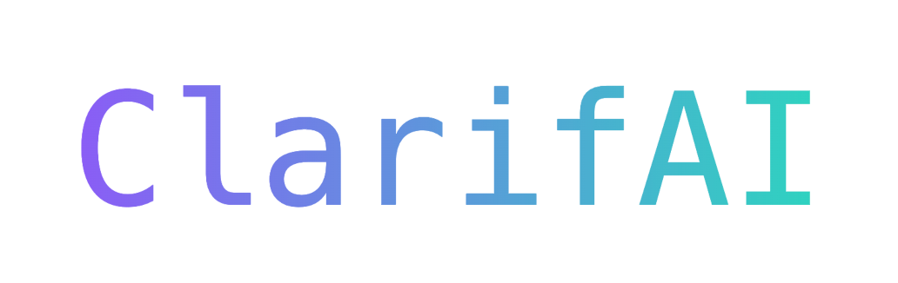

# Anomaly Reasoning

Welcome to the **Anomaly Reasoning** project, where we focus on data processing and reasoning for anomaly explanations. This project includes a small Flask backend to serve the GUI.

---

## 🚀 Getting Started

### 📦 Dependency Management with Poetry
In this project, we use **Poetry** as the dependency manager for Python.

To get started with Poetry, follow these steps:

1. Visit the [Poetry website](https://python-poetry.org/) for more details.
2. If you're using **Homebrew**, you can install Poetry via:
    ```bash
    brew install poetry
    ```
3. After installing Poetry, navigate to the root directory of the project and run the following command to install the dependencies:
    ```bash
    poetry install --no-root
    ```

---

## 📜 Anomaly Detection Rules

### Our rules

Here are the rules we've defined to identify anomalies:

1. **Unique Entries for HKONT, BSCHL, or KTOSL**  
   If any of the fields `HKONT`, `BSCHL`, or `KTOSL` are unique, the entry is considered an anomaly.

2. **Threshold-Based Rule 1**  
   An anomaly is flagged if the following conditions hold true:
    ```python
    data[(data['DMBTR'] > 910000) & (data['DMBTR'] < 911000) & 
         (data['WRBTR'] > 54000) & (data['WRBTR'] < 55000)]
    ```

3. **Threshold-Based Rule 2**
   Another anomaly is flagged under this condition:
    ```python
    data[(data['DMBTR'] > 92445000) & (data['DMBTR'] < 92446000) & 
         (data['WRBTR'] > 59585000) & (data['WRBTR'] < 59586000)]
    ```

### Detecting new rules
- Upon new data availability, to find new rules, check out the existing decision trees. 
- If they still have an accuracy of 100 %, you can continue using them and the rules we derived from them.
- If the accuracy decreases, you may want to look at why this happens and retrain the trees to derive new rules out of the new trees.
- If new features are available try filtering the data on the uniqueness of these features.
- If the filtered data only contains anomalies, you can use these filters for the uniqueness rules.
- You may also want to check out the [get value ranges notebook](src/get_value_ranges.ipynb) once new data is available to find clusters and ranges of numerical values.

---

## 🖥️ Starting the Backend

To run the backend and start processing requests, follow these steps:

1. Ensure that Flask and all other necessary packages are installed by running:
    ```bash
    poetry install
    ```

2. Once everything is installed, you can start the backend by running the following command:
    ```bash
    make run-backend
    ```

---

## 📡 Making Requests to the Backend

You can interact with the backend by making **HTTP requests** to the following endpoint:

http://127.0.0.1:5000/reasoning


### Request Body Format
When making a request, the body should be in **JSON format**, as shown below:

```json
{
  "anomaly_belnr": "507636"
}
```

This will trigger the reasoning engine to process the anomaly for the given anomaly_belnr value.